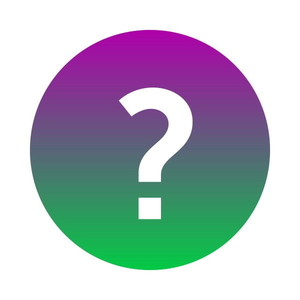

# Question-Game-MAUI

[![Contributors][contributors-shield]][contributors-url]
[![Forks][forks-shield]][forks-url]
[![Stargazers][stars-shield]][stars-url]
[![Issues][issues-shield]][issues-url]
[![MIT License][license-shield]][license-url]

 

  

<h3 align="center">Question-Game-MAUI</h3>

  

    A simple Question Game app made with .Net MAUI Framework
     
    <a href="https://github.com/diegoal3mx/Question-Game-MAUI"><strong>Explore the docs »</strong></a>
     
     
    <a href="https://github.com/diegoal3mx/Question-Game-MAUI">View Demo</a>
    ·
    <a href="https://github.com/diegoal3mx/Question-Game-MAUI/issues">Report Bug</a>
    ·
    <a href="https://github.com/diegoal3mx/Question-Game-MAUI/issues">Request Feature</a>
  

  
Table of Contents

  <ol>
    <li>
      <a href="#about-the-project">About The Project</a>
      <ul>
        <li><a href="#built-with">Built With</a></li>
      </ul>
    </li>
    <li><a href="#contributing">Contributing</a></li>
     <li><a href="#disclaimer">Disclaimer</a></li>
    <li><a href="#license">License</a></li>
    <li><a href="#contact">Contact</a></li>
  </ol>

## About The Project

[![Product Name Screen Shot][product-screenshot]](https://github.com/diegoal3mx/Question-Game-MAUI/blob/master/images/Question-Game-MAUI-Screenshot.png)

A simple multiplatform .Net MAUI app of a Question Game featuring random questions from a question set, ability to restart the game and a score system to win the game. 

(<a href="#readme-top">back to top</a>)

### Built With

* [![C#][C#]][C#-url]
* [![XAML][XAML]][XAML-url]
* [![MAUI][MAUI]][MAUI-url]

(<a href="#readme-top">back to top</a>)

## Contributing

Any contributions are **welcomed**.

If you have a suggestion you think will improve this project, please fork the repo and create a pull request. You can also open an issue with the tag "improvement".
Don't forget to give the project a star! Thanks!

1. Fork the Project
2. Create your Feature Branch (`git checkout -b feature/NewFeature`)
3. Commit your Changes (`git commit -m 'Add some NewFeature'`)
4. Push to the Branch (`git push origin feature/NewFeature`)
5. Open a Pull Request

(<a href="#readme-top">back to top</a>)

## Disclaimer

* The products, company names and logos mentioned on this app are trademarks of their respective owners.
* Tested on Windows 10

(<a href="#readme-top">back to top</a>)

## License

Distributed under the MIT License. See [`LICENSE.txt`](https://github.com/diegoal3mx/Question-Game-MAUI/blob/master/LICENSE.txt) for more information.

(<a href="#readme-top">back to top</a>)

## Contact

Project Link: [https://github.com/diegoal3mx/Question-Game-MAUI](https://github.com/diegoal3mx/Question-Game-MAUI)

(<a href="#readme-top">back to top</a>)

[contributors-shield]: https://img.shields.io/github/contributors/diegoal3mx/Question-Game-MAUI.svg?style=for-the-badge
[contributors-url]: https://github.com/diegoal3mx/Question-Game-MAUI/graphs/contributors
[forks-shield]: https://img.shields.io/github/forks/diegoal3mx/Question-Game-MAUI.svg?style=for-the-badge
[forks-url]: https://github.com/diegoal3mx/Question-Game-MAUI/network/members
[stars-shield]: https://img.shields.io/github/stars/diegoal3mx/Question-Game-MAUI.svg?style=for-the-badge
[stars-url]: https://github.com/diegoal3mx/Question-Game-MAUI/stargazers
[issues-shield]: https://img.shields.io/github/issues/diegoal3mx/Question-Game-MAUI.svg?style=for-the-badge
[issues-url]: https://github.com/diegoal3mx/Question-Game-MAUI/issues
[license-shield]: https://img.shields.io/github/license/diegoal3mx/Question-Game-MAUI.svg?style=for-the-badge
[license-url]: https://github.com/diegoal3mx/Question-Game-MAUI/blob/master/LICENSE.txt
[linkedin-shield]: https://img.shields.io/badge/-LinkedIn-black.svg?style=for-the-badge&logo=linkedin&colorB=555
[linkedin-url]: https://linkedin.com/in/linkedin_username
[product-screenshot]: images/Question-Game-MAUI-Screenshot.png
[C#]: https://img.shields.io/badge/C%23-239120?style=for-the-badge&logo=c-sharp&logoColor=white
[C#-url]:https://learn.microsoft.com/en-us/dotnet/csharp/
[XAML]: https://img.shields.io/badge/xaml-%230C54C2.svg?&style=for-the-badge&logo=xaml&logoColor=white
[XAML-url]: https://learn.microsoft.com/en-us/dotnet/maui/xaml/
[MAUI]: https://img.shields.io/badge/.NET%20MAUI-512BD4?style=for-the-badge&logo=dotnet&logoColor=white
[MAUI-url]: https://learn.microsoft.com/en-us/dotnet/maui/
